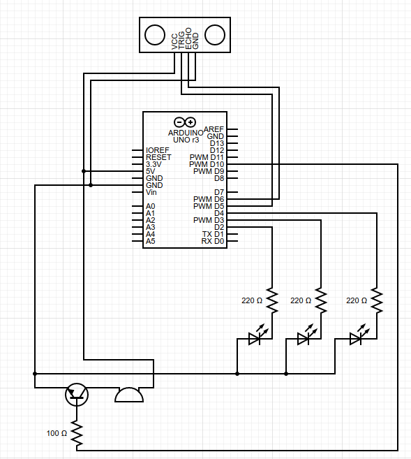

# Smart Parking Assistant Arduino Project
> Benzon Carlitos Salazar

This project is for my COMPUTER ORGANIZATION AND SYSTEM PROGRAMMING class in the 
2020 fall term.

## About
This is a collision avoidance system placed in the garage to help people park 
their cars safely without hitting their garage walls. For this project, I am 
using an ultrasonic sensor to calculate the car’s distance from the garage wall 
and displaying them with green, yellow, and red LEDs to indicate the presence 
of the car, cautioning the car, letting the car know it is in a danger zone, 
respectively.

## Hardware requirements
* Arduino UNO R3 Controller
* Ultrasonic Sensor
* Passive Buzzer
* 3 x Light Emitting Diode (Red, Green, and Yellow)
* 3 x 220Ω resistor for the LEDs
* NPN transistor
* 1 x 100Ω resistor
* Breadboard jumper wires

## Assembly



## Assembly Explanation
Red, yellow, and green LEDs are connected to digital pins 2, 3, and 4, 
respectively, with 220Ω resistors between it and the arduino. The trig pin of 
the sensor is connected to digital pin 5, and the echo pin is connected to 
digital pin 6. The buzzer is connected to analog pin A0 via an NPN transistor 
with the 100Ω resistor. All the positive pins are connected to the 5V pin of the 
arduino, and all the negative pins are connected to the ground pin of the arduino.

## Code Explanation
We start by defining our constants and the global variables which will be used 
throughout the code. We then define each pin mode in the setup section, we then 
create a function ```turnAllOff()```, which will be responsible for turning off all 
the LEDs and the buzzer.

Two things are happening inside the ```loop()```, first we want to calculate the 
distance between the car and the sensor, in inches, by reading the values from 
the sensor. Then, we start checking the values of each distances; if the distance 
is greater than 200 inches, there’s nothing in the garage, if the distance 
between 200 inches and 55 inches, we turn on the green LED, if the distance is 
between 55 and 15 inches, we turn on the yellow LED, if the distance is less 
than or equal 15 inches, we turn on the red LED, and when the distance is less 
than 8 inches, we turn on the buzzer along with red LED. 

After that, we want to check to see if the car is still moving or not. And we 
do this by setting a ```counter``` whose values are based on the car’s movement 
inside the garage, this will in turn decide when to turn off the LEDs. It will compare 
the value of ```Distance``` with a ```TempDistance``` and if the values are the same, 
this indicates that the car has stopped moving, therefore we increment the 
```counter```. If the car moves at any-time, we reset the ```counter``` to 0. 
Then finally, we set the ```TempDistance``` equal to the value of ```Distance```. 
We also set the ```counter```’s limit to 20 CPU cycles.
